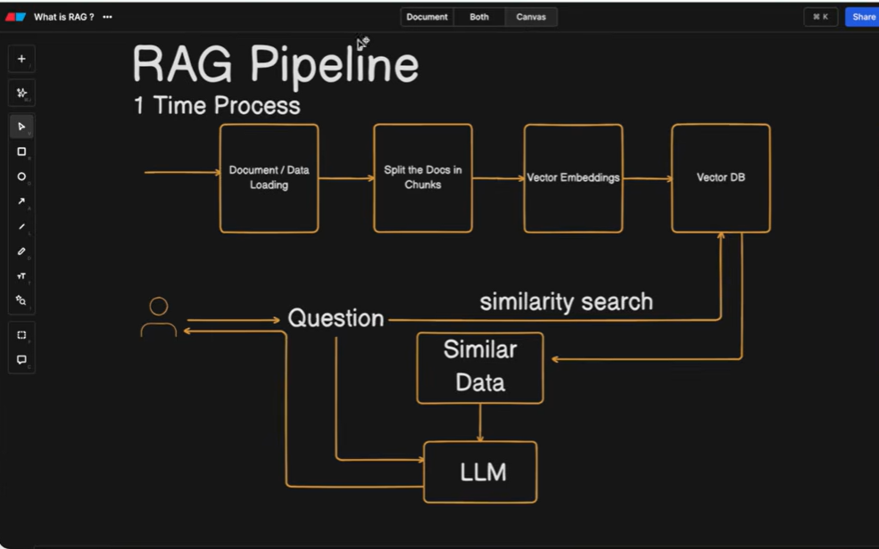

What is RAG?
- RAG (Retrieval Augmented Generation) is a technique that uses a combination of language models, document stores, and a retrieval system to generate answers to questions.

RAG Pipeline: 
- document load
- Split docs in chunks
- vector Embeddings
- Store in Vector DB
- Query DB
- LLM

